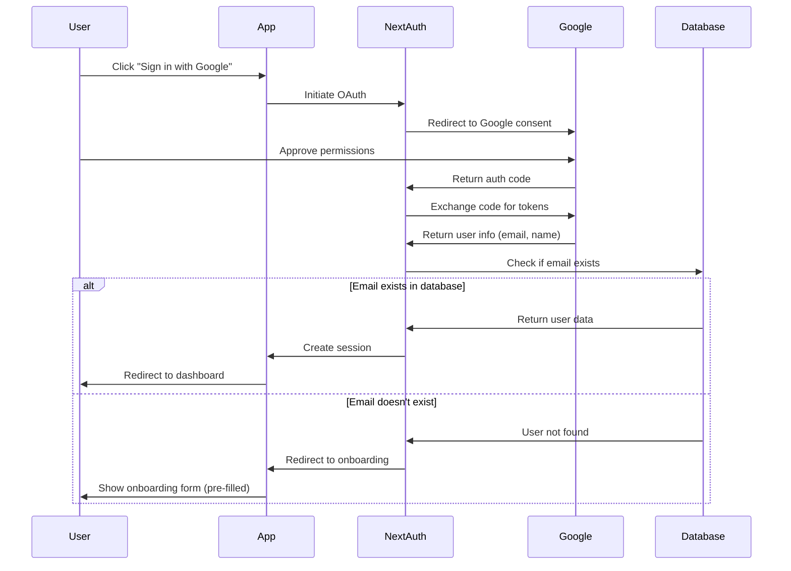

# Google OAuth Login - Architecture & Logic

## Overview

Implemented Google OAuth 2.0 authentication using NextAuth.js, allowing users to sign in with their Google accounts alongside the existing email/password authentication.

---

## Architecture

### Components

```
┌─────────────────────────────────────────────────────┐
│                   User Interface                     │
│              app/signin/page.tsx                     │
│   [Email/Password Form] | [Google Sign In Button]   │
└─────────────────────────┬───────────────────────────┘
                          │
                          ▼
┌─────────────────────────────────────────────────────┐
│              NextAuth.js Middleware                  │
│        app/api/auth/[...nextauth]/route.ts          │
│  ┌───────────────┐  ┌──────────────────────────┐   │
│  │ Google OAuth  │  │ Credentials Provider     │   │
│  │ Provider      │  │ (Email/Password)         │   │
│  └───────────────┘  └──────────────────────────┘   │
└─────────────────────────┬───────────────────────────┘
                          │
                          ▼
┌─────────────────────────────────────────────────────┐
│              Database (PostgreSQL)                   │
│            service_providers table                   │
│     email (unique) | password | slug | ...          │
└─────────────────────────────────────────────────────┘
```

---

## Authentication Flow

### 1. Google OAuth Flow



---

## Key Logic Components

### 1. NextAuth Configuration (`app/api/auth/[...nextauth]/route.ts`)

#### Providers:

**Google OAuth Provider:**
```typescript
GoogleProvider({
  clientId: process.env.GOOGLE_CLIENT_ID,
  clientSecret: process.env.GOOGLE_CLIENT_SECRET,
})
```

**Credentials Provider (Email/Password):**
```typescript
CredentialsProvider({
  async authorize(credentials) {
    // 1. Query database for user by email
    // 2. Verify password with bcrypt
    // 3. Return user object if valid
    // 4. Return null if invalid
  }
})
```

#### Callbacks:

**signIn Callback:**
```typescript
async signIn({ user, account, profile }) {
  if (account?.provider === "google") {
    // 1. Check if email exists in database
    const result = await pool.query(
      'SELECT id, slug, name FROM service_providers WHERE email = $1',
      [user.email]
    )

    if (result.rows.length === 0) {
      // 2a. New user → Redirect to onboarding
      return `/onboard?google=true&email=${user.email}&name=${user.name}`
    } else {
      // 2b. Existing user → Attach provider data to user object
      const provider = result.rows[0]
      user.id = provider.id
      user.slug = provider.slug
      // Continue sign in
    }
  }
  return true
}
```

**JWT Callback:**
```typescript
async jwt({ token, user }) {
  // Add custom fields to JWT token
  if (user) {
    token.id = user.id
    token.slug = user.slug
    token.email = user.email
    token.business_name = user.business_name
  }
  return token
}
```

**Session Callback:**
```typescript
async session({ session, token }) {
  // Add custom fields to session object
  session.user.id = token.id
  session.user.slug = token.slug
  session.user.email = token.email
  return session
}
```

---

## User Scenarios

### Scenario 1: New Google User (First Time)

**Flow:**
1. User clicks "Sign in with Google"
2. Google consent screen appears
3. User approves permissions
4. NextAuth receives Google profile (email, name)
5. Database check: Email not found
6. **Redirect to onboarding:** `/onboard?google=true&email=john@gmail.com&name=John`
7. User completes business information
8. Account created in database with Google email
9. User redirected to dashboard

**Database State After:**
```sql
INSERT INTO service_providers (
  email, name, slug, business_name, password, ...
) VALUES (
  'john@gmail.com',  -- From Google
  'John',            -- From Google
  'johns-business',  -- From onboarding
  "John's Business", -- From onboarding
  NULL,              -- No password (Google-only user)
  ...
);
```

---

### Scenario 2: Existing Google User (Returning)

**Flow:**
1. User clicks "Sign in with Google"
2. Google consent screen (may skip if already approved)
3. NextAuth receives Google profile
4. Database check: Email found
5. **User data loaded from database**
6. JWT token created with user info
7. Session created
8. User redirected to dashboard

**Database Query:**
```sql
SELECT id, slug, name, business_name, email
FROM service_providers
WHERE email = 'john@gmail.com'
```

---

### Scenario 3: User with Email/Password Account Signs in with Google

**Current Behavior:**
- If email exists in database → User signed in automatically
- Works seamlessly (same email = same account)

**Flow:**
1. User originally signed up with email/password
2. Later, user clicks "Sign in with Google" with same email
3. Database finds existing account by email
4. User signed in to existing account
5. **Account automatically linked** (no duplicate created)

---

### Scenario 4: Email/Password Sign In (Unchanged)

**Flow:**
1. User enters email and password
2. NextAuth Credentials provider validates
3. Database query for user
4. bcrypt password verification
5. JWT token created
6. Session created
7. User redirected to dashboard

---

## Session Management

### JWT Token Contents:
```typescript
{
  id: "123",                    // Provider ID
  slug: "johns-business",       // Provider slug
  email: "john@gmail.com",      // Provider email
  name: "John",                 // Provider name
  business_name: "John's Business",
  iat: 1234567890,             // Issued at
  exp: 1235172690,             // Expires (7 days)
}
```

### Session Object (Client-Side):
```typescript
{
  user: {
    id: "123",
    slug: "johns-business",
    email: "john@gmail.com",
    name: "John",
    business_name: "John's Business"
  },
  expires: "2024-03-07T12:00:00.000Z"
}
```

### Session Storage:
- **JWT token** stored in HTTP-only cookie (`next-auth.session-token`)
- **Not accessible via JavaScript** (XSS protection)
- **Automatic CSRF protection** (SameSite cookie)
- **7-day expiration** (configurable)

---

## Database Schema Integration

### Existing Schema:
```sql
CREATE TABLE service_providers (
  id SERIAL PRIMARY KEY,
  email VARCHAR(255) UNIQUE NOT NULL,  -- Used for Google matching
  password VARCHAR(255),                -- NULL for Google-only users
  name VARCHAR(255) NOT NULL,
  slug VARCHAR(255) UNIQUE NOT NULL,
  business_name VARCHAR(255),
  -- ... other fields
);
```

### Google User Fields:
- **email**: From Google profile (unique identifier)
- **name**: From Google profile
- **password**: NULL (Google handles authentication)
- **slug**: Generated during onboarding
- **business_name**: Entered during onboarding

### Dual Authentication Support:
- Users can have **both** Google OAuth and password
- Email is the unique identifier
- Password can be NULL (Google-only) or set (dual auth)

---

## Security Features

### 1. OAuth 2.0 Standard
- Industry-standard authentication protocol
- Google handles password security
- No password storage for Google-only users

### 2. JWT Session Security
- **HTTP-only cookies**: Not accessible via JavaScript
- **SameSite attribute**: CSRF protection
- **Secure flag**: HTTPS-only in production
- **7-day expiration**: Automatic session timeout

### 3. CSRF Protection
- NextAuth built-in CSRF tokens
- State parameter in OAuth flow
- Cookie-based verification

### 4. No Credential Exposure
- Client secrets stored server-side only
- OAuth tokens never exposed to client
- Database password hashes (bcrypt)

---

## Environment Variables

### Required:
```bash
# NextAuth Configuration
NEXTAUTH_SECRET=<random 32-byte secret>
NEXTAUTH_URL=http://localhost:3000

# Google OAuth Credentials
GOOGLE_CLIENT_ID=<from Google Cloud Console>
GOOGLE_CLIENT_SECRET=<from Google Cloud Console>

# Existing JWT for custom API
JWT_SECRET=<existing secret>
```

### Generation:
```bash
# Generate NEXTAUTH_SECRET
openssl rand -base64 32
```

---

## API Endpoints (Auto-created by NextAuth)

### Sign In:
- `GET /api/auth/signin` - Sign in page
- `POST /api/auth/signin` - Process sign in

### OAuth Callback:
- `GET /api/auth/callback/google` - Google OAuth redirect
- Handles OAuth code exchange
- Creates session
- Redirects to app

### Session Management:
- `GET /api/auth/session` - Get current session
- `POST /api/auth/signout` - Sign out
- `GET /api/auth/csrf` - Get CSRF token

---

## Error Handling

### OAuth Errors:
1. **User denies consent**: Redirect to signin with error
2. **Invalid credentials**: Show error message
3. **Database connection error**: Show generic error
4. **Email already exists**: Auto-link account (same email)

### Redirects:
- **Success (new user)**: `/onboard?google=true&email=...`
- **Success (existing user)**: `/dashboard/{slug}`
- **Error**: `/signin?error=...`

---

## Testing Strategy

### Unit Tests (Future):
- Test OAuth callback logic
- Test user matching by email
- Test session creation
- Test redirect logic

### Integration Tests:
- Mock Google OAuth response
- Test database queries
- Test onboarding redirect
- Test dashboard redirect

### Manual Testing:
1. New Google user → Onboarding flow
2. Existing Google user → Dashboard
3. Email/password user → Dashboard
4. Sign out → Session cleared
5. Refresh page → Session persists

---

## Limitations & Considerations

### Current Limitations:
1. **Single email per account**: Cannot have multiple Google accounts for same email
2. **No profile picture**: Google profile picture not saved (yet)
3. **No email verification**: Trust Google's verification
4. **No account unlinking**: Once linked, cannot unlink Google

### Future Enhancements:
1. **Profile pictures**: Save Google avatar to database
2. **Multiple providers**: Add Facebook, GitHub OAuth
3. **Account linking UI**: Let users manage connected accounts
4. **Email verification**: Verify non-Google emails
5. **2FA**: Two-factor authentication option

---

## Troubleshooting

### "redirect_uri_mismatch"
- **Cause**: Redirect URI not configured in Google Console
- **Fix**: Add `http://localhost:3000/api/auth/callback/google`

### "NEXTAUTH_SECRET not set"
- **Cause**: Missing environment variable
- **Fix**: Generate and add to `.env.local`

### "Invalid client secret"
- **Cause**: Wrong credentials
- **Fix**: Verify `GOOGLE_CLIENT_ID` and `GOOGLE_CLIENT_SECRET`

### User redirected to onboarding every time
- **Cause**: Email not matching database
- **Fix**: Check email in database query is lowercase

---

## Performance Considerations

### Session Lookup:
- JWT tokens are stateless (no database lookup per request)
- Only database query during sign in
- Fast session validation

### Database Queries:
```sql
-- Sign in (1 query)
SELECT * FROM service_providers WHERE email = $1

-- Session validation (0 queries)
-- JWT verified cryptographically
```

### Caching:
- Consider caching user data in session
- Reduce database queries
- Update cache on user changes

---

## Compliance & Privacy

### GDPR Compliance:
- Users can delete accounts (including Google data)
- Clear privacy policy required
- Consent for data collection

### Google OAuth Requirements:
- Privacy policy URL required
- Terms of service URL required
- Logo and branding optional
- Verification for sensitive scopes

### Data Retention:
- Store only necessary Google data (email, name)
- Don't store access tokens (not needed)
- Delete user data on account deletion

---

## Summary

### What Works:
✅ Google OAuth sign in
✅ Email/password sign in (unchanged)
✅ Automatic user matching by email
✅ Smart routing (onboarding vs dashboard)
✅ Secure JWT sessions
✅ HTTP-only cookies

### What's Required:
⏳ Google Cloud Console setup
⏳ OAuth credentials configuration
⏳ Environment variables setup
⏳ Testing with real Google accounts

### What's Next:
- Complete Google OAuth setup (see `docs/GOOGLE_OAUTH_SETUP.md`)
- Test with real Google accounts
- Deploy with production credentials
- Monitor OAuth usage

---

**Status**: Implementation complete, waiting for OAuth credentials setup
